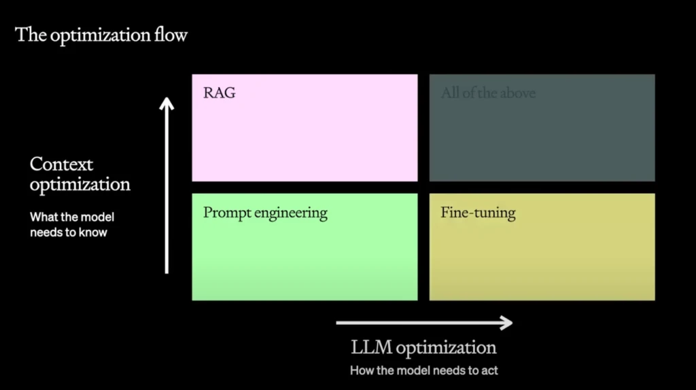
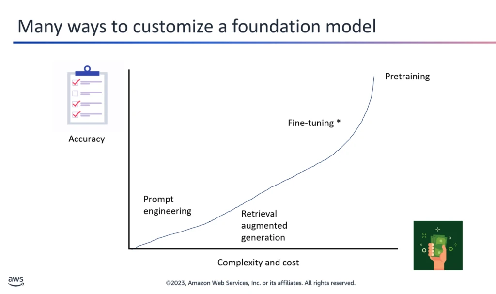
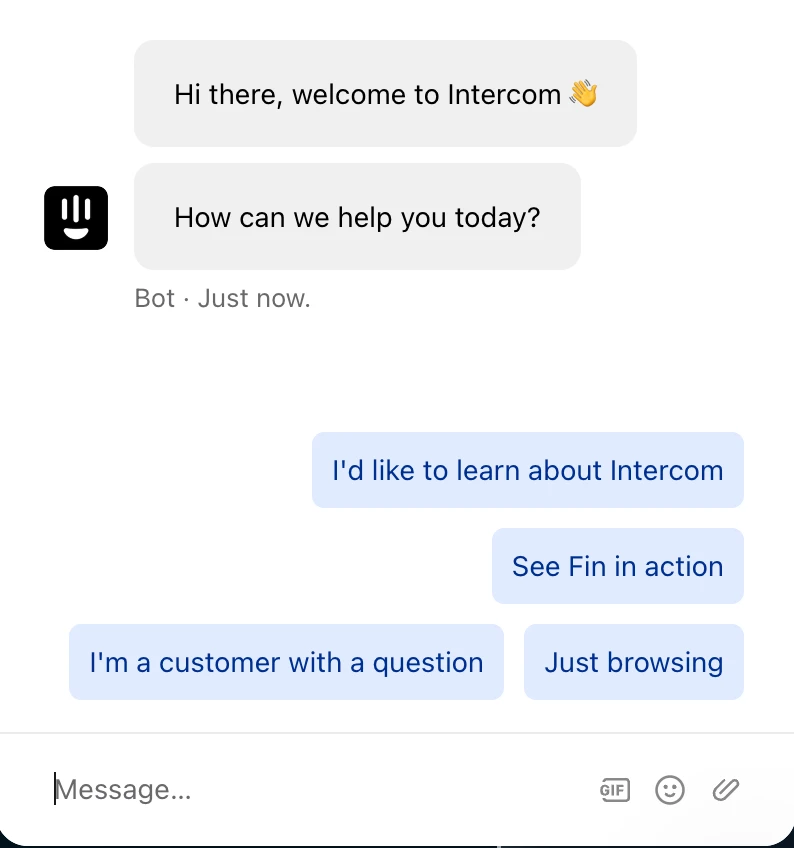

From my experience using Open AI to build an AI Assistant, hopefully it’s helpful!

### First, the main concepts of AI and LLMs, in plain english.

There’s a lot of complicated terms about LLMs like memory, agents, threads, system prompts, functions, embedding, tools, etc. I was super confused about this at first.


*A bunch of jargon from the LangChain homepage*

It’s actually very simple, **you send a bunch of stuff in the prompt, and you get a response.** That’s it.

All these terms are describing how the data you send and receive is structured. **Memory** means you are storing all the prompts and responses and sending those back and forth each time. **Functions** means you tell the model what a function is called, and what parameters you are looking for, then it tells you if it’s appropriate to call that function based on the user prompt (example below). **Tools** are what happens when a function is called (like hitting an API). **Agents** are apps that talk to the LLM. I talk about embedding and fine-tuning below.

### How does an LLM actually work?

In the simplest terms, an LLM is predicting the next word. That means it takes your prompt and predicts what the first word of the response should be based on its training data, then the second word, then it does that again and again and again.

Technically it’s predicting the next token, not full word, but you get the idea. The reason it works so well is because it has been fed labeled training data on how to respond to questions. LLMs have emergent properties, meaning no one understands the specific mechanics on why they work as well as they do.

If you want to dive deeper, [this video by Andrej Karpathy](https://youtu.be/zjkBMFhNj_g?si=9jtpX3K5j7cC5vhK) is awesome.

### How good your AI behaves is all about the instructions and context you give it.

You can tweak the data you send to the model, you can also tweak the response. You can get a response from the model, tweak it, send it back, tweak it, and on and on. Making it work how you want is largely trial and error.



*Optimization flow from Open AI. RAG and fine-tuning are discussed below.*

### Here’s how I made my AI work better. Starting with the system prompt.

The system prompt is an text block giving the LLM instructions and context that is not shown to the user. It’s like a hidden first prompt.

It’s important to be explicit and detailed in how you want the model to behave, and provide things like where the user is url, page name, date, what it shouldn’t do, etc. This is the first thing you should tweak to get better responses. For example:

*“You are a helpful assistant. You only answer questions related to the text in the prompts, do not respond to any questions unrelated to this contextual information. Ask for clarification if needed, do not make up answers. Take your time and reason through each answer. The user is currently on the menu page for Bob’s Burgers, they selected the Montecito location. The user can call for help at [555-123-4567](tel:555-123-4567) or email [bobs@burgers.com](mailto:bobs@burgers.com).”*

This should be dynamic, so you can update the system prompt with the page title, the name and ID of the menu item they are viewing, or anything that is relevant.

The more specific context and instructions, the better.

### How do I tell the AI about my documentation, PDFs, articles, etc?

**RAG (retrieval augmented generation)** is how you give the model contextual information like docs q/a, current events, or giving it information about any text. Here’s an example.

Prompt: *“how do I add a new user to my account.”*

You want the model to know about your document on adding new users, so you need to fetch that and feed it to the model.

You can send a [function definition](https://platform.openai.com/docs/guides/function-calling) for getDocs anytime a user asks a question about new users. For example:

```
const tools = [
    {
      type: "function",
      function: {
        name: "getDocs",
        description: "Get documentation for adding a new user.",
        parameters: {
          type: "object",
          properties: {
            search: {
              type: "string",
              description: "The search term to use to search the documentation."
            },
          },
          required: ["search"],
        },
      },
    },
  ];

  const response = await openai.chat.completions.create({
    model: "gpt-3.5-turbo-1106",
    messages: messages,
    tools: tools
  });
```

The AI responds that you should call getDocs, and it gives you the search term, so you hit your doc search API and get a result. At that point you can display the doc to the user, or send a summary of it back to the model with the original prompt, and get a natural language response.

### You might not need vector embeddings.

So many articles and tutorials talk about embeddings, but the truth is that they are slow and difficult to get right. You probably don’t need it.

Embedding is storing your text in a way the LLM can use it. This happens to be with a bunch of numbers called vectors, which requires a special database. When you feed it some text (like a prompt) it does a similarity search between the prompt and your embeddings to find the most similar chunk of text. It gives you back a chunk of text related to the prompt.

The problem is that this is slow, and if you have a lot of text, it can be hard to distinguish between similar documents, and sometimes you need the whole document to get the full context. Sure you can optimize this by bringing it offline, but that only works for text that never changes. Updating your docs would then be a nightmare.

**If you only need to search files or docs, something like elastic search is faster and cheaper. Use a function and grab the right document like in the RAG example above.**

### Functions are magical. 🦄

Functions take AI from a simple question/answer to a bot that can take actions for you. *(Like Siri or Clippy. But better, right? RIGHT?)*

As you saw in the docs example above, functions allow you to take actions based on a prompt. For example, the user prompts “what is XYZ stock price?” You have a function for getStockPrice, and send that along with the prompt to the model. The response tells you to call your function with the parameter of stock name = XYZ. You call that and give the user the price. It’s really cool, and works reliably. I found that when you can’t get a consistent answer for a particular prompt, you can use a function to force it to be the same any time.

### You might not need fine tuning.



Some people think fine-tuning is how you “teach” a model about your company documentation or an author’s writing, but that’s not how it works.

RAG (above) is how you give the model contextual information to answer a question. Fine tuning is if you need the model to behave in a way that it doesn’t, or do something novel that there’s no public information on.

To fine tune properly you need a decent sized sample of quality prompts and responses that you format for training, usually in [jsonl](https://jsonlines.org/). The quality of the training data is the most important factor: more high quality training data = better results.

Fine tuning might not be as hard as you think, especially with APIs like [this one from OpenAI.](https://platform.openai.com/docs/guides/fine-tuning) There are a lot of things you can do to improve responses before you need fine tuning, try better system prompts with few shot learning, RAG, etc. first.

### Contextual suggestions are key.



If a user is on the menu page, show suggestions of what they can do. For example “Add a hamburger with fries to my cart” or “how long does delivery take?”.

This helps the user understand what actions are possible or recommended, and gives them a shortcut to using them.

### Scope down your project.

Remember how bad Siri was? And still is? Don’t try to build an everything bot.

This can happen by accident if you’re not careful, because most LLMs will answer any question unless you stop them from doing so.

For example, if you want to provide a PDF q/a, don’t let people ask “write me a python script for google docs”. Use the system prompt to tell the model what it can and can’t answer. This works better with some models than others, for example gpt-3.5 mostly ignores complex instructions, but gpt-4 is much better at it.

### I’m still learning.

That’s what I’ve learned so far, but I know I have a lot more to learn. If you have findings of your own, share them!
