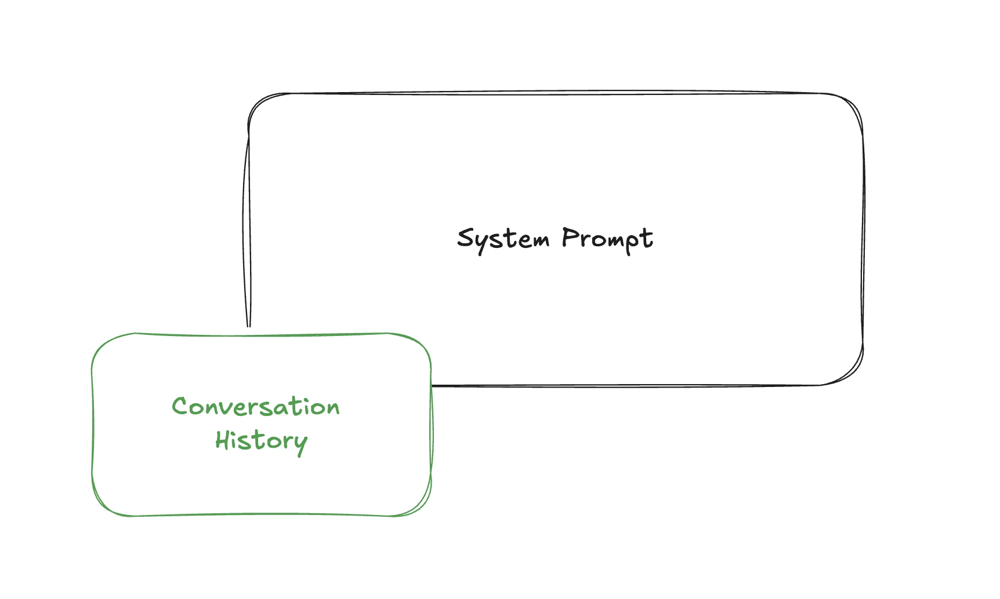
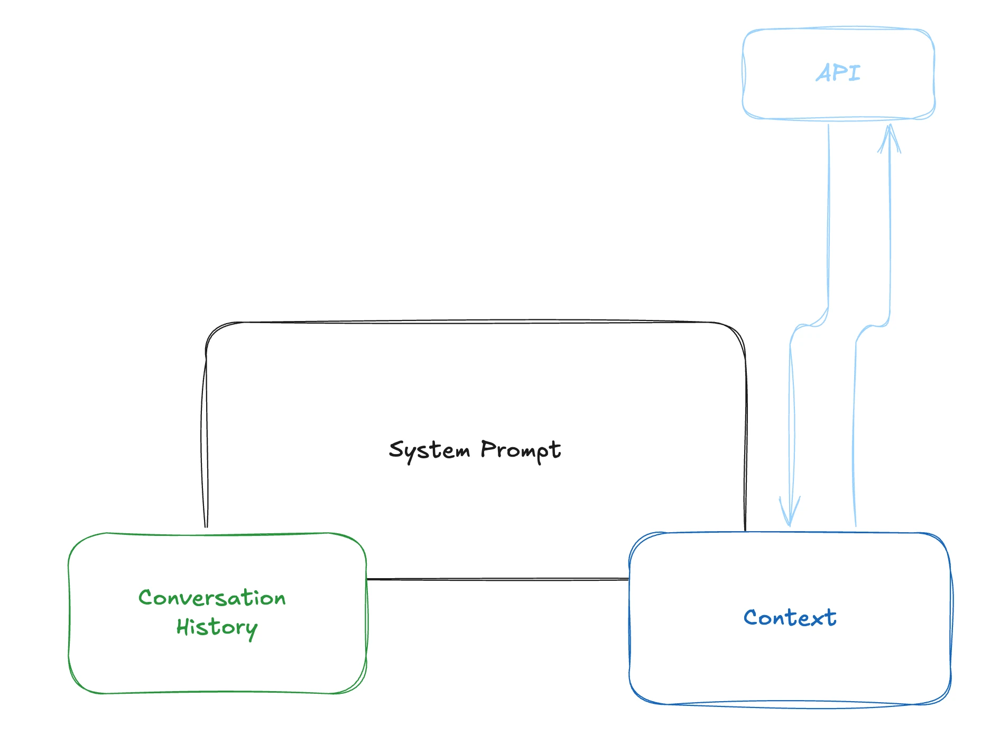
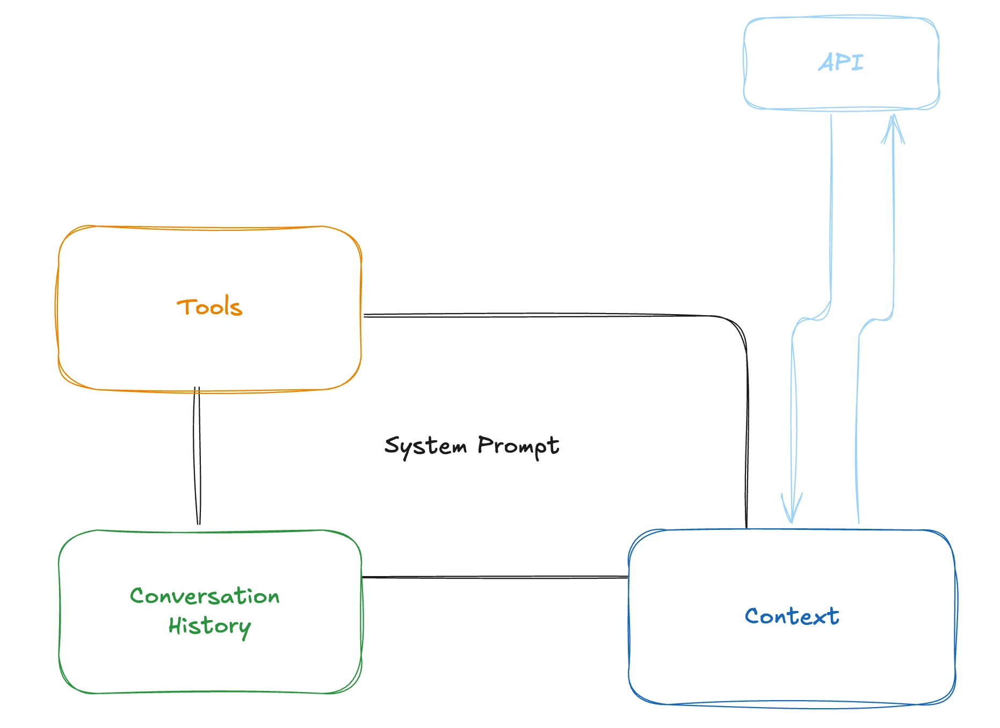
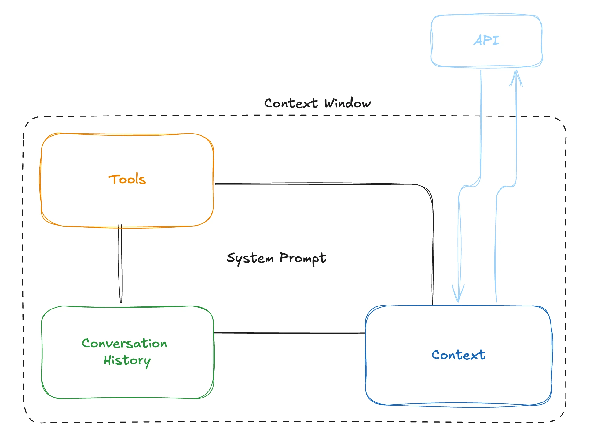
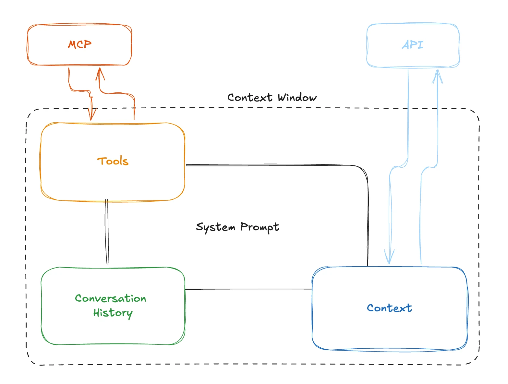
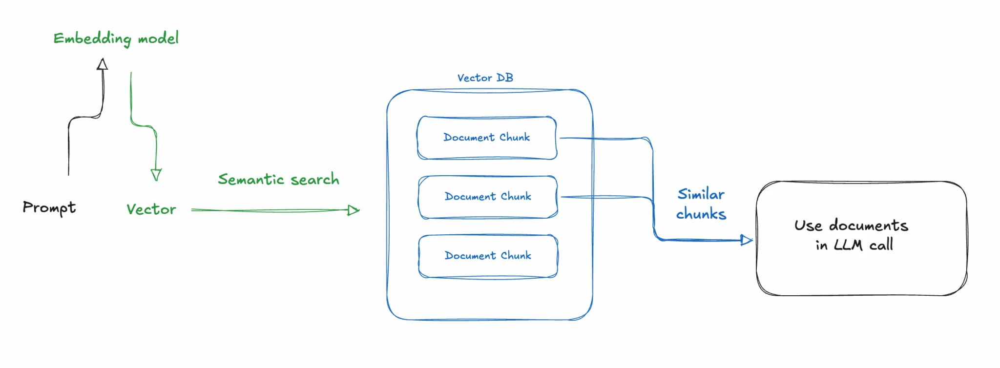
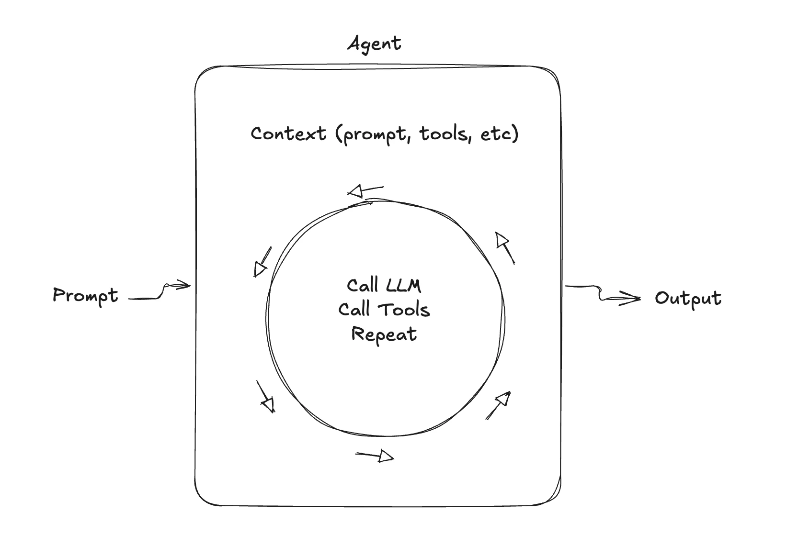
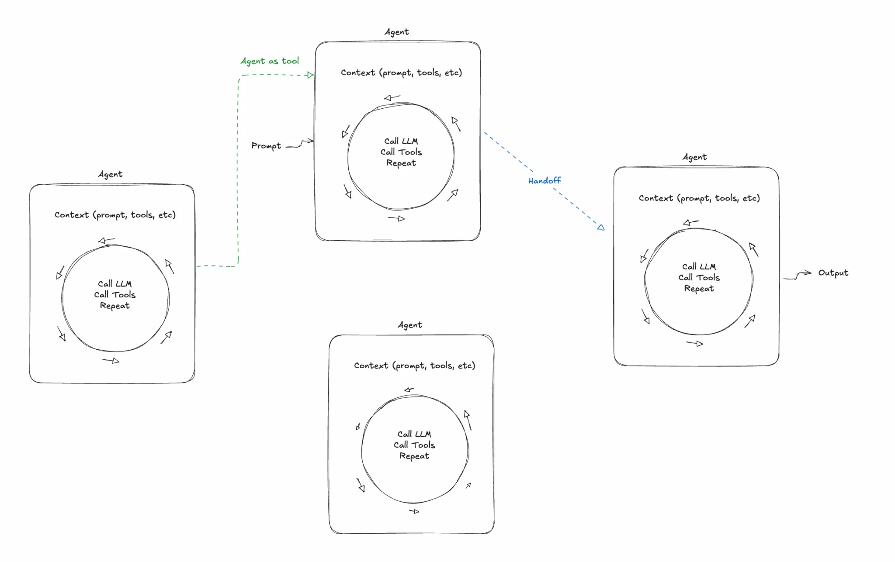
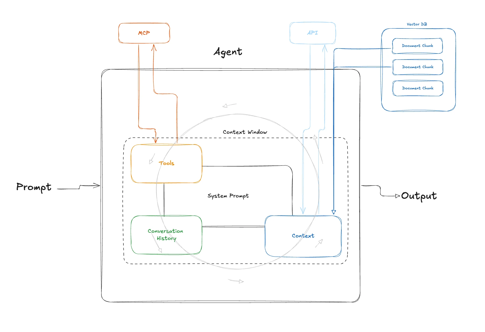

If you build software products with LLMs (or AI), it’s crucial to understand how they work in a practical sense. This guide is a primer on 7 essential concepts you need to know, from beginner to expert. It’s as non-technical as possible in hopes anyone from product, UX, C-suite, and even engineering can benefit from.

Benefits of this guide:

- Zero calories
- Learn how to build better LLM based products
- Sound smart at meetings

No matter your motivation, I hope you’ll get something out of this. Now let’s keep ourselves entertained by pretending these are video game levels.


Let’s start with the basics.

## Level 1 – Text In, Text Out

Assuming you’ve tried ChatGPT, Claude, or Gemini, you know that you type in some text and you get text back.

It may sound obvious, but it’s important: **text in/text out is the basis of all LLM interactions.**

This simplified my mental model a lot early on when hearing about prompts, memory, tools, RAG, and context. It sounds complicated but it’s all just text we send to the model.

We send instructions on how the model should behave in what is called a system prompt. This is treated differently by the model; it’s given more weight than a prompt from a user, for example. We may have a system prompt such as:

> You are a helpful assistant for planning trips to Disneyland. You talk like Jack Sparrow from Pirates of the Caribbean. Your goal is to provide proactive advice for finding a hotel, transportation, and finding your way around the park.

When we converse with an LLM, this prompt gets sent every time, along with a user prompt.



The code might look like this:

```
const payload = {
  system: “You are a helpful assistant for planning trips to Disneyland. You talk like Jack Sparrow from Pirates of the Caribbean. Your goal is to provide proactive advice for finding a hotel, transportation, and finding your way around the park.”,
  messages: [
    {
      role: “user”,
      content: “I’m planning a trip to Disneyland next month with my family. Where should we stay?”
    }
  ]
};
```

As the conversation continues, we add new messages from the LLM and the user and send them all each time. You may think there is some sort of memory and you’d only send a new message each time, but there isn’t.

As we progress in complexity throughout this article, remember it’s all just text in, text out. (Even voice to voice AI still uses a text LLM, it just transcribes on the way in and converts to speech on the way out!)

### Side quest: structuring the system prompt

We can use XML or Markup to structure the system prompt, which can be helpful for both LLMs and humans.

```
const payload = {
  system: `You are a helpful assistant for planning trips to Disneyland.

<customer_history>
- Previous visit: March 2023, stayed at Grand Californian
- Traveled with 2 adults, 2 children (ages 5, 8)
- Preferred attractions: Space Mountain, Haunted Mansion
</customer_history>

<park_information>
Current hotel availability and pricing for next month...
</park_information>

## We can also use markdown

- **providing emphasis can be helpful**
- structure is also easier for humans to read

`,
  messages: [
    {
      role: “user”,
      content: “I’m planning another trip to Disneyland next month. Any recommendations based on my last visit?”
    }
  ]
};
```

Check out Anthropic’s [Claude system prompts](https://platform.claude.com/docs/en/release-notes/system-prompts) for an interesting look at how they instruct their models.

## Level 2 – Adding Context

What else can we add besides instructions and prompts?

Context is additional information that’s useful to help the LLM respond correctly. This could be a document, a web page, information about a customer’s account, etc. Providing the right context at the right time is the most important thing we can do to improve model responses.

Here’s a super simple way to think about it: go to ChatGPT or Claude and ask about the weather, then go to weather.com and copy/paste the weather for today. This is how LLMs answer questions accurately.

### RAG

Of course we can’t copy/paste in an LLM application, so instead we fetch data. If a customer asks about the weather, we’d use an API to go to weather.com, and insert today’s weather into the system prompt.

This is called RAG, or retrieval augmented generation.



Now we are sending 3 things, the system prompt, user/assistant prompts as conversation history, and weather data as context.

## Level 3 – Tools

To get the weather we called an API, this is called a tool. A tool is an action we can take that the LLM understands and can help with.

Let’s look at another example of a tool, web search.

In our Disney agent example, we need to find park maps, show times, and other up to date information. When a customer needs a plan, we want to search the web for articles from Disney and other websites. We can do this with a web search tool.

Think of tools as us telling the LLM, “Hey, you can search the web if you need to, you just need to know what to search for.” Then when someone asks about show times this weekend, the LLM thinks, “Hey, I should search for this, here’s the query: ‘what are the show times at Disneyland for the weekend of December 10th.’”

This comes back to us in the response. It doesn’t search the web for us—it tells us to go search the web. We have to write the code to do that ourselves.

The part we send to an LLM for a tool is called the tool definition. It looks like this:

```
const tools = [
  {
    type: “function”,
    function: {
      name: “search_web”,
      description: “Search the web for current information about Disneyland shows, events, and schedules”,
      parameters: {
        type: “object”,
        properties: {
          query: {
            type: “string”,
            description: “The search query to look up”
          }
        },
        required: [”query”]
      }
    }
  }
];
```

We send this to the LLM along with our prompts and context.



A user asks “what time is the Indiana Jones show today?” The LLM doesn’t know the answer to this, but it knows it has a tool to search the web, so it tells us to do that.

This is what the response looks like:

```
{
  role: “assistant”,
  content: null,
  tool_calls: [
    {
      id: “call_123”,
      type: “function”,
      function: {
        name: “search_web”,
        arguments: ‘{”query”:”what are the Indiana Jones show times at Disneyland for December 10th”}’
      }
    }
  ]
}
```

In our code, when we see tool_calls, we look for the name, find search_web, then we call a web search function.

**Important: the LLM is not calling a tool, we are! The LLM just tells us what tool it thinks we should call.**

At that point, we most likely want to send the tool result back to the LLM and say, “Hey, here’s the result from that tool you wanted me to call.” It can then give a nice plain English response like “I found those show times for you, they are…”

You can have lots of tools, but you have to tell the LLM how and when to use them. The more specific they are, the better.

Tools are the basis of many AI products. It’s how you look up documentation to answer questions, fetch data requested by the customer, or create a new resource.

### Side quest: context window

All this information the LLM receives goes into what is called the context window. This window is measured in tokens, which are like parts of words. This window is limited, for example Gemini 1.5 pro allows 1.5 million tokens. Even with large window sizes, models do better with smaller amounts of context, so it’s important to only put what you need in there.



Another thing to remember is that adding something to the context window changes ALL outputs. If you put too much extra stuff in there, you can get context rot. It may stop calling your tools correctly, or forget some system instructions.

> Everything in the context window has an influence on the output. Some words and tokens have more influence than others, but everything counts to some extent. That’s why you don’t want to have text in your context window that you don’t want to influence the result. Quality degrades: the more context, the worse the results. Most models provide better results with less context. – [Amp](https://ampcode.com/guides/context-management)

Your job is to give the LLM the right context at the right time, and nothing more, to get the best outputs.

### Side quest: MCP

You can build a tool like web search just for you, but others may want to use it too. That’s where MCP comes in.

Let’s say you are building lots of LLM-based apps at a company across multiple teams, and they all need the web search feature. It doesn’t make sense to build this over and over, so you should make a reusable API any team can use.

MCP, or Model Context Protocol, is a way to expose functionality like our web search to LLMs. It’s similar conceptually to building an API, except it’s made for LLMs. Instead of Swagger docs and individual endpoints for every feature, we expose tools.



The way an agent uses MCP is by first requesting a list of tools. It uses those tools the same way we talked about web search above, except when it calls a tool, it sends a request to the MCP server to call the tool and give us a response.

Here’s what the web search tool workflow would look like via MCP:

1. Our workflow has a request come in. It’s time to get our prompt and tools, so we gather our local tool definitions, then we call our MCP server’s **list tools** endpoint. It gives us back `web_search` and tells us how it works.
2. We send a request to the LLM, including the prompt and tools.
3. The LLM responds that we should call the web search tool, so we call the MCP server again, this time to **invoke the tool.**
4. We get a response back with the search results, then send another LLM request to use those results to answer the user’s question.

MCP is great for hosting tools and prompts for multiple consumers, but you don’t always need it. If you will be the only consumer of your own tools, MCP can be overkill.

## Level 5: Semantic Search

We are stepping up the level a difficulty a bit here, but stick with it!

What if we have a knowledge base for our company, and we want to answer questions based on those documents. We can create a tool that can do a search of those docs, but traditional keyword searches are old news. In the world of LLMs, we want to search by the *meaning* of the user’s question, not just keywords.

LLMs can help you search text by semantic meaning as opposed to traditional keyword search. For example, you can ask “what would keep me warm on my feet outside in the winter” and it’ll show you wool-lined hiking boots. A traditional keyword-based search would fail miserably at this. Semantic search can understand the meaning behind your words without needing a keyword to show you relevant results.

This is done using vectors, which are numerical representations that capture semantic meaning.



- Documents are turned into vectors using an embedding model
- Documents are split into chunks (e.g., 500 tokens at a time) and stored in a vector database
- A prompt comes in, we turn that into vectors using the same embedding model
- We then do a similarity search of the prompt vs our document chunks
- Relevant docs are returned

The important thing to understand here is that we are using mathematical similarity to retrieve relevant documents, not LLM intelligence.

When we get our results back, we will have metadata on the chunks that has the original document text. For example, our query about warm footwear could return a few sentences from our product data where hiking boots are mentioned. Depending on your retrieval settings, it can grab some information before hiking boots are mentioned and some afterwards. You can also have it return multiple chunks, which is useful in case there are other options for warm footwear in our data.

These chunks of text are returned from a tool call and then sent back to the LLM to answer the user’s inquiry. This is how we reduce hallucinations and provide accurate, up-to-date information to the model.

Semantic search is incredibly powerful and can be used in lots of interesting ways like eCommerce search, filtering large lists of tools, and finding a needle in a haystack of text.

### Side quest: memory

LLMs don’t have memory, so if you want them to remember something, you have to store that and look it up later. We can embed previous conversations and use semantic retrieval on that so the LLM can remember things. It’s the same as using documentation, but you search over previous conversations instead.

## Level 6: Agents

Most of what we’ve discussed so far could be called an LLM workflow. It’s where you send a payload and you get a response back. You may add some business logic in there as well, but it’s largely deterministic code, minus the LLM response.



An agent is when you put this process into a loop and you let the LLM decide how it should work. For example, an LLM agent could take in a prompt from a customer and then come up with its own plan on how to handle that request.

Let’s say you ask the agent to plan a Disneyland trip, telling it things like “I have a 5-year-old who loves Frozen and is scared of big drops.”

Here’s how our agentic loop would work, from the agent’s perspective:

- Examine the request and call tools:

  - planning tool to create a list of tasks
  - execute task: web search tool for “Disneyland frozen show december 10th”
  - execute task: web search tool for “Disneyland opening hours december 10th”
  - execute task: planning tool to update plan with tasks completed
- Examine the output of these tools, see if this completes the task

  - If yes, return response to user
  - If no, go back to step 1

For something to be an agent, it must create its own plan for handling a task, call its own tools and decide when it’s finished.

Agents can handle more complex reasoning, so you may think you should use agents for everything. That’s not the case! Because of the added reasoning loops, agents take longer to do anything. Users might not want to wait 30 seconds for an answer to a simple question, no matter how good the answer is. If latency is a concern, you may want to use a workflow instead.

Agents are more complex, and harder to get right. My advice is to start with a workflow, then only move to an agent when you know you need to.

## Level 7: Final Boss! Multi-agent



If you’re building a large system with a lot of functionality, it’s difficult to do it with a single agent. Let’s say our trip planner expands to have very sophisticated flight booking, car rentals, hotel booking, ticket purchasing, lunch reservations and dinner reservations, virtual tours when inside the park, in-depth information about Disney characters and movies, and more.

Technically, we could create tools for all of these things and add them to a single agent. But the problem is that the LLM gets confused and doesn’t understand how to handle such a diverse set of tasks. *This is because of context rot, remember that from level 3?*

It might book us a dinner reservation when we’re trying to get a hotel, or it will start telling us about a Disney character when we wanted to see a show.

The LLMs we have today work best when they have a focused skill set with tools that help them accomplish tasks within that skill set. To solve this problem, we need to have specialized agents: for example, a hotel booking agent that has all the hotel booking tools and a separate agent for booking car rentals or getting a tour of the park, etc.

The hard part becomes orchestrating those agents and making sure you invoke the right one at the right time and each agent has the proper context passed off from the previous one, etc. Multi-agent systems are very complex and can be very difficult to get right.

Most LLM products at the time of this writing do not orchestrate multiple agents. They may have a manual agent switcher like Copilot, or the more sophisticated projects like Amp can orchestrate a few agents. I’m working on a multi-agent system, and I can confirm that this is very easy to do poorly, and very hard to do well.

## Putting it all together



To have a really useful LLM conversational application, we put all of these things together. We create a well-defined prompt, we pass in the right context at the right time, and we use semantic search and tools.

The hard part is orchestrating all of these things. We need to use the right tool at the right time, pass in the right customer context or company documentation to answer questions without hallucinations, add memory to make the experience seamless, and do all these things with low latency, error handling, and great UX.

If you do that, you can create a valuable LLM application. Godspeed!
